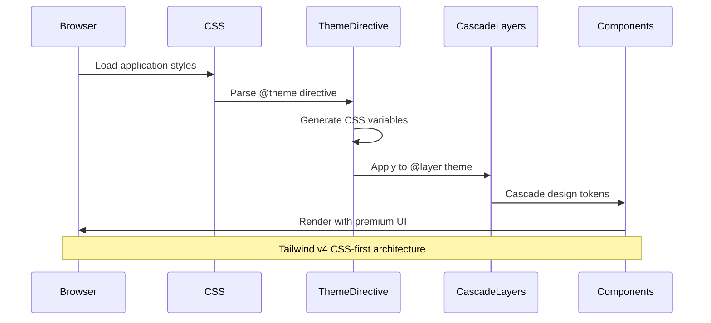
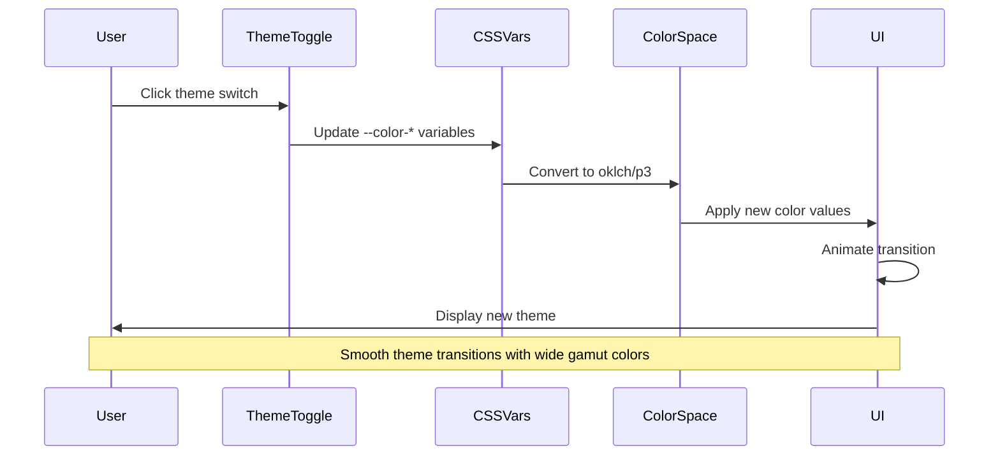

# Design Document: Premium UI Enhancement with Tailwind CSS v4

## Overview

This design transforms the application into a premium, polished experience using Tailwind CSS v4's cutting-edge features including CSS-first configuration, native cascade layers, container queries, and modern color spaces. The enhancement goes beyond typography to include sophisticated animations, glassmorphism effects, advanced gradients, micro-interactions, and spatial design patterns inspired by Dribbble and Apple websites. The system leverages Tailwind v4's new architecture with CSS variables, @theme directive, and enhanced utilities to create a cohesive, high-end user experience with smooth transitions, depth perception, and attention to detail that elevates the entire interface.

## Architecture

The premium UI system is built on Tailwind CSS v4's CSS-first architecture, leveraging native CSS features like cascade layers, container queries, and the new @theme directive. The system uses CSS variables for dynamic theming, custom properties for design tokens, and utility classes for component composition.

```mermaid
graph TD
    A[@theme Directive - Design Tokens] --> B[CSS Cascade Layers]
    B --> C[Container Queries Layer]
    C --> D[Component Utilities]
    D --> E[Page Implementations]
    
    F[CSS Variables - Dynamic Theming] --> A
    G[Color Spaces - P3/Oklch] --> A
    H[Animation System] --> D
    I[Glassmorphism Effects] --> D
    J[Micro-interactions] --> E
```

## Sequence Diagrams

### Tailwind v4 Theme Initialization



### Dynamic Theme Switching with Color Spaces



## Components and Interfaces

### Tailwind v4 Theme Configuration Interface

**Purpose**: Define the complete design system using Tailwind v4's @theme directive and CSS-first configuration.

**Interface**:
```typescript
interface TailwindV4ThemeConfig {
  colors: ColorSystemConfig
  spacing: SpacingConfig
  typography: TypographyConfig
  effects: EffectsConfig
  animations: AnimationConfig
  containers: ContainerConfig
}

interface ColorSystemConfig {
  colorSpace: 'srgb' | 'display-p3' | 'oklch'
  palette: {
    primary: ColorScale
    secondary: ColorScale
    accent: ColorScale
    neutral: ColorScale
    semantic: SemanticColors
  }
  gradients: GradientDefinitions
}

interface ColorScale {
  50: string   // oklch(98% 0.02 250) - lightest
  100: string  // oklch(95% 0.04 250)
  200: string  // oklch(90% 0.06 250)
  300: string  // oklch(82% 0.08 250)
  400: string  // oklch(70% 0.12 250)
  500: string  // oklch(58% 0.16 250) - base
  600: string  // oklch(48% 0.18 250)
  700: string  // oklch(38% 0.16 250)
  800: string  // oklch(28% 0.12 250)
  900: string  // oklch(20% 0.08 250)
  950: string  // oklch(12% 0.04 250) - darkest
}

interface SemanticColors {
  success: ColorScale
  warning: ColorScale
  error: ColorScale
  info: ColorScale
}

interface GradientDefinitions {
  mesh: string[]      // Multi-color mesh gradients
  radial: string[]    // Radial gradients for depth
  conic: string[]     // Conic gradients for effects
  shimmer: string[]   // Animated shimmer effects
}

interface EffectsConfig {
  glassmorphism: GlassmorphismConfig
  shadows: ShadowConfig
  blur: BlurConfig
  glow: GlowConfig
}

interface GlassmorphismConfig {
  background: string  // backdrop-blur + transparency
  border: string      // subtle border with gradient
  shadow: string      // soft shadow for depth
  variants: {
    light: GlassVariant
    medium: GlassVariant
    heavy: GlassVariant
  }
}

interface GlassVariant {
  blur: string        // backdrop-blur-sm/md/lg/xl
  opacity: number     // background opacity 0-1
  saturation: number  // backdrop-saturate value
  brightness: number  // backdrop-brightness value
}

interface ShadowConfig {
  elevation: {
    xs: string   // Subtle lift
    sm: string   // Card elevation
    md: string   // Modal elevation
    lg: string   // Dropdown elevation
    xl: string   // Maximum elevation
  }
  colored: {
    primary: string   // Colored shadow matching primary
    accent: string    // Colored shadow matching accent
    glow: string      // Soft glow effect
  }
  inner: string[]     // Inner shadows for depth
}

interface AnimationConfig {
  transitions: TransitionConfig
  keyframes: KeyframeConfig
  microInteractions: MicroInteractionConfig
}

interface TransitionConfig {
  duration: {
    instant: string   // 75ms
    fast: string      // 150ms
    normal: string    // 300ms
    slow: string      // 500ms
    slower: string    // 700ms
  }
  timing: {
    ease: string           // ease
    easeIn: string         // ease-in
    easeOut: string        // ease-out
    easeInOut: string      // ease-in-out
    spring: string         // cubic-bezier spring
    bounce: string         // cubic-bezier bounce
  }
}

interface MicroInteractionConfig {
  hover: {
    lift: string      // transform: translateY(-2px)
    scale: string     // transform: scale(1.02)
    glow: string      // box-shadow glow effect
  }
  active: {
    press: string     // transform: scale(0.98)
    ripple: string    // ripple animation
  }
  focus: {
    ring: string      // focus ring with offset
    glow: string      // focus glow effect
  }
}

interface ContainerConfig {
  queries: {
    xs: string   // @container (min-width: 20rem)
    sm: string   // @container (min-width: 24rem)
    md: string   // @container (min-width: 28rem)
    lg: string   // @container (min-width: 32rem)
    xl: string   // @container (min-width: 36rem)
  }
}
```

**Responsibilities**:
- Define all design tokens using Tailwind v4 @theme directive
- Configure modern color spaces (oklch, display-p3)
- Set up container queries for responsive components
- Define animation and effect systems
- Ensure consistency across the design system

### Premium UI Component Interface

**Purpose**: Provide reusable React components with premium effects and micro-interactions.

**Interface**:
```typescript
interface GlassCardProps {
  variant?: 'light' | 'medium' | 'heavy'
  hover?: boolean
  glow?: boolean
  gradient?: boolean
  className?: string
  children: React.ReactNode
}

interface AnimatedButtonProps {
  variant?: 'primary' | 'secondary' | 'ghost' | 'glass'
  size?: 'sm' | 'md' | 'lg'
  icon?: React.ReactNode
  loading?: boolean
  ripple?: boolean
  glow?: boolean
  className?: string
  onClick?: () => void
  children: React.ReactNode
}

interface HeroSectionProps {
  title: string
  subtitle?: string
  gradient?: boolean
  mesh?: boolean
  particles?: boolean
  blur?: boolean
  className?: string
}

interface FloatingElementProps {
  delay?: number
  duration?: number
  distance?: number
  direction?: 'up' | 'down' | 'left' | 'right'
  className?: string
  children: React.ReactNode
}

interface ShimmerTextProps {
  text: string
  gradient?: string[]
  speed?: 'slow' | 'normal' | 'fast'
  className?: string
}
```

**Responsibilities**:
- Render components with premium visual effects
- Apply glassmorphism, gradients, and shadows
- Handle micro-interactions and animations
- Ensure accessibility compliance
- Support container queries for responsive behavior

## Data Models

### Tailwind v4 CSS Theme Definition

```css
/* Tailwind v4 @theme directive for design tokens */
@theme {
  /* Color system using oklch for perceptual uniformity */
  --color-primary-50: oklch(98% 0.02 250);
  --color-primary-100: oklch(95% 0.04 250);
  --color-primary-500: oklch(58% 0.16 250);
  --color-primary-900: oklch(20% 0.08 250);
  
  /* Wide gamut colors for modern displays */
  --color-accent-vivid: oklch(70% 0.25 330);
  --color-accent-p3: color(display-p3 0.9 0.3 0.5);
  
  /* Spacing scale with fluid values */
  --spacing-xs: clamp(0.25rem, 0.5vw, 0.5rem);
  --spacing-sm: clamp(0.5rem, 1vw, 0.75rem);
  --spacing-md: clamp(0.75rem, 1.5vw, 1rem);
  --spacing-lg: clamp(1rem, 2vw, 1.5rem);
  --spacing-xl: clamp(1.5rem, 3vw, 2rem);
  
  /* Typography with fluid scaling */
  --font-size-xs: clamp(0.75rem, 0.7rem + 0.25vw, 0.875rem);
  --font-size-sm: clamp(0.875rem, 0.8rem + 0.3vw, 1rem);
  --font-size-base: clamp(1rem, 0.9rem + 0.4vw, 1.125rem);
  --font-size-lg: clamp(1.125rem, 1rem + 0.5vw, 1.25rem);
  --font-size-xl: clamp(1.25rem, 1.1rem + 0.6vw, 1.5rem);
  --font-size-2xl: clamp(1.5rem, 1.3rem + 0.8vw, 2rem);
  --font-size-3xl: clamp(1.875rem, 1.6rem + 1vw, 2.5rem);
  --font-size-4xl: clamp(2.25rem, 2rem + 1.5vw, 3rem);
  
  /* Glassmorphism effects */
  --glass-light: rgba(255, 255, 255, 0.1);
  --glass-medium: rgba(255, 255, 255, 0.15);
  --glass-heavy: rgba(255, 255, 255, 0.25);
  --glass-blur-sm: 8px;
  --glass-blur-md: 16px;
  --glass-blur-lg: 24px;
  
  /* Elevation shadows with color */
  --shadow-xs: 0 1px 2px 0 rgb(0 0 0 / 0.05);
  --shadow-sm: 0 1px 3px 0 rgb(0 0 0 / 0.1), 0 1px 2px -1px rgb(0 0 0 / 0.1);
  --shadow-md: 0 4px 6px -1px rgb(0 0 0 / 0.1), 0 2px 4px -2px rgb(0 0 0 / 0.1);
  --shadow-lg: 0 10px 15px -3px rgb(0 0 0 / 0.1), 0 4px 6px -4px rgb(0 0 0 / 0.1);
  --shadow-xl: 0 20px 25px -5px rgb(0 0 0 / 0.1), 0 8px 10px -6px rgb(0 0 0 / 0.1);
  --shadow-glow-primary: 0 0 20px -5px var(--color-primary-500);
  --shadow-glow-accent: 0 0 20px -5px var(--color-accent-vivid);
  
  /* Animation timing functions */
  --ease-spring: cubic-bezier(0.68, -0.55, 0.265, 1.55);
  --ease-bounce: cubic-bezier(0.68, -0.6, 0.32, 1.6);
  --ease-smooth: cubic-bezier(0.4, 0, 0.2, 1);
  
  /* Container query breakpoints */
  --container-xs: 20rem;
  --container-sm: 24rem;
  --container-md: 28rem;
  --container-lg: 32rem;
  --container-xl: 36rem;
}
```

**Validation Rules**:
- All colors must use oklch or display-p3 for wide gamut support
- Spacing values must use clamp() for fluid scaling
- Shadow values must include both elevation and optional glow
- Animation timing must use cubic-bezier for smooth motion
- Container queries must be defined in rem units

### Premium Effect Configurations

```typescript
interface GlassmorphismEffect {
  background: string      // rgba with transparency
  backdropFilter: string  // blur + saturate + brightness
  border: string          // subtle gradient border
  shadow: string          // soft shadow for depth
  borderRadius: string    // rounded corners
}

interface MeshGradient {
  type: 'radial' | 'conic' | 'linear'
  colors: string[]        // 3-5 colors in oklch
  positions: number[]     // color stop positions
  angle?: number          // for linear/conic
  blur: number            // blur amount for mesh effect
  animate?: boolean       // animated gradient
}

interface MicroInteraction {
  trigger: 'hover' | 'focus' | 'active' | 'scroll'
  property: string        // CSS property to animate
  from: string            // initial value
  to: string              // final value
  duration: number        // in milliseconds
  timing: string          // timing function
  delay?: number          // optional delay
}

interface ParallaxConfig {
  speed: number           // 0.1 to 2.0
  direction: 'vertical' | 'horizontal'
  trigger: 'scroll' | 'mouse'
  easing: string          // easing function
}
```

**Validation Rules**:
- Glassmorphism must have backdrop-filter support check
- Mesh gradients must have 3-5 colors for optimal effect
- Micro-interactions must have duration between 75ms and 700ms
- Parallax speed must be between 0.1 and 2.0 for smooth effect

## Algorithmic Pseudocode

### Tailwind v4 Theme Generation

```typescript
/**
 * Generate Tailwind v4 theme configuration using @theme directive
 * 
 * Preconditions:
 * - colorSpace is valid ('srgb', 'display-p3', 'oklch')
 * - baseColors contain valid color values
 * - All numeric values are positive
 * 
 * Postconditions:
 * - Returns valid CSS @theme block
 * - All colors use specified color space
 * - Design tokens are properly namespaced
 * - Values support fluid scaling where applicable
 */
function generateTailwindV4Theme(
  colorSpace: 'srgb' | 'display-p3' | 'oklch',
  baseColors: ColorPalette,
  spacing: SpacingScale,
  typography: TypographyScale
): string {
  // Initialize theme block
  let themeCSS = '@theme {\n'
  
  // Generate color scale in specified color space
  for (const [name, baseColor] of Object.entries(baseColors)) {
    const scale = generateColorScale(baseColor, colorSpace)
    for (const [shade, value] of Object.entries(scale)) {
      themeCSS += `  --color-${name}-${shade}: ${value};\n`
    }
  }
  
  // Generate fluid spacing values
  for (const [size, value] of Object.entries(spacing)) {
    const fluidValue = generateFluidValue(value.min, value.max, 320, 1920)
    themeCSS += `  --spacing-${size}: ${fluidValue};\n`
  }
  
  // Generate fluid typography
  for (const [size, value] of Object.entries(typography)) {
    const fluidSize = generateFluidValue(value.min, value.max, 320, 1920)
    themeCSS += `  --font-size-${size}: ${fluidSize};\n`
  }
  
  themeCSS += '}\n'
  return themeCSS
}
```

**Loop Invariants**:
- All generated color values are valid in specified color space
- All spacing and typography values use clamp() for fluid scaling
- Theme variables maintain consistent naming convention

### Glassmorphism Effect Generator

```typescript
/**
 * Generate glassmorphism effect styles
 * 
 * Preconditions:
 * - variant is 'light', 'medium', or 'heavy'
 * - baseColor is valid rgba or oklch color
 * - Browser supports backdrop-filter
 * 
 * Postconditions:
 * - Returns complete glassmorphism style object
 * - Includes fallback for unsupported browsers
 * - Effect provides proper depth and transparency
 * - Border and shadow enhance glass effect
 */
function generateGlassmorphism(
  variant: 'light' | 'medium' | 'heavy',
  baseColor: string,
  borderGradient?: string[]
): GlassmorphismEffect {
  // Define variant parameters
  const variants = {
    light: { opacity: 0.1, blur: 8, saturate: 1.2, brightness: 1.1 },
    medium: { opacity: 0.15, blur: 16, saturate: 1.4, brightness: 1.15 },
    heavy: { opacity: 0.25, blur: 24, saturate: 1.6, brightness: 1.2 }
  }
  
  const config = variants[variant]
  
  // Generate background with transparency
  const background = adjustOpacity(baseColor, config.opacity)
  
  // Generate backdrop filter
  const backdropFilter = `
    blur(${config.blur}px)
    saturate(${config.saturate})
    brightness(${config.brightness})
  `.trim()
  
  // Generate border with gradient
  const border = borderGradient
    ? `1px solid transparent`
    : `1px solid rgba(255, 255, 255, 0.2)`
  
  const borderImage = borderGradient
    ? `linear-gradient(135deg, ${borderGradient.join(', ')}) 1`
    : undefined
  
  // Generate soft shadow
  const shadow = `
    0 8px 32px 0 rgba(0, 0, 0, 0.1),
    inset 0 1px 0 0 rgba(255, 255, 255, 0.1)
  `.trim()
  
  return {
    background,
    backdropFilter,
    border,
    borderImage,
    shadow,
    borderRadius: '1rem'
  }
}
```

**Loop Invariants**: N/A (no loops)

### Mesh Gradient Generator

```typescript
/**
 * Generate multi-color mesh gradient with blur effect
 * 
 * Preconditions:
 * - colors array has 3-5 valid oklch colors
 * - positions array matches colors length
 * - blur value is between 0 and 100
 * - All colors are in same color space
 * 
 * Postconditions:
 * - Returns CSS gradient string with mesh effect
 * - Colors blend smoothly with perceptual uniformity
 * - Blur creates organic mesh appearance
 * - Gradient is optimized for performance
 * 
 * Loop Invariants:
 * - All processed colors maintain oklch format
 * - Position values are in ascending order
 * - Each color stop is properly formatted
 */
function generateMeshGradient(
  colors: string[],
  positions: number[],
  blur: number,
  type: 'radial' | 'conic' | 'linear' = 'radial'
): string {
  // Validate inputs
  if (colors.length < 3 || colors.length > 5) {
    throw new Error('Mesh gradients require 3-5 colors')
  }
  
  // Generate color stops
  const colorStops: string[] = []
  for (let i = 0; i < colors.length; i++) {
    const color = colors[i]
    const position = positions[i]
    colorStops.push(`${color} ${position}%`)
  }
  
  // Build gradient based on type
  let gradient: string
  switch (type) {
    case 'radial':
      gradient = `radial-gradient(circle at 50% 50%, ${colorStops.join(', ')})`
      break
    case 'conic':
      gradient = `conic-gradient(from 0deg at 50% 50%, ${colorStops.join(', ')})`
      break
    case 'linear':
      gradient = `linear-gradient(135deg, ${colorStops.join(', ')})`
      break
  }
  
  // Apply blur filter for mesh effect
  const meshEffect = `
    background: ${gradient};
    filter: blur(${blur}px);
    transform: scale(1.1);
  `.trim()
  
  return meshEffect
}
```

**Loop Invariants**:
- All processed colors maintain oklch format
- Position values are in ascending order
- Each color stop is properly formatted

### Micro-Interaction Animation

```typescript
/**
 * Generate micro-interaction animation with spring physics
 * 
 * Preconditions:
 * - trigger is valid event type
 * - property is animatable CSS property
 * - duration is between 75ms and 700ms
 * - from and to values are valid for property
 * 
 * Postconditions:
 * - Returns CSS animation or transition
 * - Animation uses spring easing for natural feel
 * - Performance is optimized (GPU acceleration)
 * - Respects prefers-reduced-motion
 */
function generateMicroInteraction(
  trigger: 'hover' | 'focus' | 'active',
  property: string,
  from: string,
  to: string,
  duration: number,
  spring: boolean = true
): string {
  // Use spring easing for natural motion
  const timing = spring
    ? 'cubic-bezier(0.68, -0.55, 0.265, 1.55)'
    : 'cubic-bezier(0.4, 0, 0.2, 1)'
  
  // Generate transition
  const transition = `
    transition: ${property} ${duration}ms ${timing};
  `.trim()
  
  // Generate state-specific styles
  const stateStyle = `
    &:${trigger} {
      ${property}: ${to};
    }
  `.trim()
  
  // Add reduced motion support
  const reducedMotion = `
    @media (prefers-reduced-motion: reduce) {
      transition: none;
    }
  `.trim()
  
  return `
    ${property}: ${from};
    ${transition}
    ${stateStyle}
    ${reducedMotion}
  `.trim()
}
```

**Loop Invariants**: N/A (no loops)

## Key Functions with Formal Specifications

### Function 1: generateColorScale()

```typescript
function generateColorScale(
  baseColor: string,
  colorSpace: 'oklch' | 'display-p3',
  steps: number = 11
): ColorScale
```

**Preconditions:**
- `baseColor` is valid color in specified color space
- `colorSpace` is 'oklch' or 'display-p3'
- `steps` is positive odd integer (typically 11 for 50-950 scale)

**Postconditions:**
- Returns color scale with perceptually uniform steps
- Lightness values range from 98% (50) to 12% (950)
- Chroma values maintain consistency across scale
- All colors are valid in specified color space
- Middle step (500) matches base color

**Loop Invariants:**
- Each step has lightness value less than previous step
- Chroma values stay within valid range for color space
- All generated colors are perceptually distinct

### Function 2: applyGlassmorphism()

```typescript
function applyGlassmorphism(
  element: HTMLElement,
  variant: 'light' | 'medium' | 'heavy',
  options?: GlassOptions
): void
```

**Preconditions:**
- `element` is valid DOM element
- `variant` is one of allowed values
- Browser supports backdrop-filter (or has fallback)

**Postconditions:**
- Element has glassmorphism effect applied
- Backdrop blur is active with proper fallback
- Border and shadow enhance glass effect
- Performance is optimized (GPU acceleration)
- Effect degrades gracefully on unsupported browsers

**Loop Invariants:** N/A (no loops)

### Function 3: createMeshGradient()

```typescript
function createMeshGradient(
  colors: string[],
  type: 'radial' | 'conic' | 'linear',
  animate?: boolean
): string
```

**Preconditions:**
- `colors` array has 3-5 valid oklch colors
- `type` is one of allowed gradient types
- All colors use same color space

**Postconditions:**
- Returns CSS gradient with mesh effect
- Colors blend with perceptual uniformity
- Gradient is optimized for performance
- If animate is true, includes animation keyframes
- Gradient creates organic, flowing appearance

**Loop Invariants:**
- All processed colors maintain oklch format
- Color stops are evenly distributed
- Gradient maintains smooth transitions

### Function 4: generateMicroInteraction()

```typescript
function generateMicroInteraction(
  trigger: InteractionTrigger,
  effect: InteractionEffect,
  duration: number
): AnimationConfig
```

**Preconditions:**
- `trigger` is valid interaction event
- `effect` defines valid CSS transformations
- `duration` is between 75ms and 700ms

**Postconditions:**
- Returns animation configuration with spring easing
- Animation respects prefers-reduced-motion
- Effect uses GPU-accelerated properties
- Timing feels natural and responsive
- No layout thrashing occurs

**Loop Invariants:** N/A (no loops)

### Function 5: applyContainerQuery()

```typescript
function applyContainerQuery(
  component: React.Component,
  breakpoints: ContainerBreakpoints
): StyledComponent
```

**Preconditions:**
- `component` is valid React component
- `breakpoints` define valid container query values
- Browser supports container queries (or has fallback)

**Postconditions:**
- Component responds to container size, not viewport
- Styles adapt based on parent container width
- Fallback to viewport queries on unsupported browsers
- No performance degradation from container queries
- Component is truly modular and reusable

**Loop Invariants:** N/A (no loops)

## Example Usage

### Basic Typography Implementation

```typescript
// Example 1: Using typography tokens in CSS
const styles = {
  heading: {
    fontFamily: 'var(--font-display)',
    fontSize: 'var(--text-4xl)',
    fontWeight: 'var(--font-bold)',
    lineHeight: 'var(--leading-tight)',
    letterSpacing: 'var(--tracking-tight)',
  },
  body: {
    fontFamily: 'var(--font-sans)',
    fontSize: 'var(--text-base)',
    fontWeight: 'var(--font-normal)',
    lineHeight: 'var(--leading-relaxed)',
    letterSpacing: 'var(--tracking-normal)',
  }
}

// Example 2: Using Typography components
function HeroSection() {
  return (
    <section>
      <DisplayText size="xl" gradient animate>
        Premium Recruiting Platform
      </DisplayText>
      <Heading level={2} size="2xl" weight="semibold" tracking="tight">
        Find the perfect candidate
      </Heading>
      <Text variant="body" size="lg" color="muted">
        AI-powered resume parsing and candidate intelligence
      </Text>
    </section>
  )
}

// Example 3: Fluid typography in Tailwind
<h1 className="font-display text-fluid-5xl font-bold leading-tight tracking-tight">
  Welcome to VectorHire
</h1>

// Example 4: Responsive typography with breakpoints
<p className="text-base md:text-lg lg:text-xl leading-relaxed">
  This text scales smoothly across all screen sizes
</p>

// Example 5: Premium typography utilities
<div className="space-y-6">
  <h2 className="font-display text-4xl font-bold tracking-tight text-gradient">
    Featured Candidates
  </h2>
  <p className="font-sans text-lg leading-relaxed text-muted max-w-prose">
    Discover top talent with our AI-powered matching system
  </p>
  <span className="font-mono text-xs uppercase tracking-widest text-accent">
    New Feature
  </span>
</div>
```

## Correctness Properties

### Universal Quantification Statements

1. **Typography Hierarchy Property**
   ```
   ∀ page ∈ Application:
     ∀ h1, h2 ∈ page where h1.level < h2.level:
       h1.fontSize > h2.fontSize ∧
       h1.fontWeight >= h2.fontWeight
   ```
   All headings maintain proper visual hierarchy with larger headings having larger font sizes and equal or greater font weights.

2. **Accessibility Compliance Property**
   ```
   ∀ text ∈ Application:
     text.fontSize >= 14px ∧
     text.lineHeight >= 1.5 (for body text) ∧
     text.contrast >= 4.5:1 (WCAG AA)
   ```
   All text meets minimum accessibility standards for size, line height, and contrast.

3. **Responsive Scaling Property**
   ```
   ∀ element ∈ Application with fluid typography:
     ∀ viewport ∈ [320px, 1920px]:
       element.fontSize ∈ [minSize, maxSize] ∧
       element.fontSize is continuous function of viewport width
   ```
   All fluid typography scales smoothly and continuously within defined bounds across all viewport sizes.

4. **Font Loading Property**
   ```
   ∀ font ∈ CriticalFonts:
     font.isPreloaded = true ∧
     font.display = 'swap' ∧
     ∃ fallback ∈ SystemFonts: fallback.metrics ≈ font.metrics
   ```
   All critical fonts are preloaded with swap strategy and have metric-compatible fallbacks to prevent layout shift.

5. **Consistency Property**
   ```
   ∀ component1, component2 ∈ Application:
     component1.typographyToken = component2.typographyToken ⟹
       component1.visualAppearance = component2.visualAppearance
   ```
   Components using the same typography tokens render identically across the application.

## Error Handling

### Error Scenario 1: Font Loading Failure

**Condition**: Primary font fails to load from CDN or local source
**Response**: 
- Fallback to system font stack immediately
- Log error to monitoring service
- Display warning in development mode
**Recovery**: 
- Retry font loading after 5 seconds
- Use cached font if available
- Maintain layout with fallback fonts

### Error Scenario 2: Invalid Typography Token

**Condition**: Component references undefined typography token
**Response**:
- Fall back to base typography values
- Log warning with component name and token
- Highlight issue in development mode
**Recovery**:
- Use nearest valid token from type scale
- Suggest correct token in error message

### Error Scenario 3: Accessibility Violation

**Condition**: Typography configuration violates WCAG standards
**Response**:
- Prevent deployment in CI/CD pipeline
- Generate detailed accessibility report
- Highlight specific violations
**Recovery**:
- Automatically adjust to minimum compliant values
- Provide suggestions for proper values
- Require manual review before proceeding

### Error Scenario 4: Responsive Breakpoint Conflict

**Condition**: Responsive typography creates overlapping or conflicting sizes
**Response**:
- Detect conflicts during build time
- Log warning with specific breakpoints
- Use mobile-first cascade to resolve
**Recovery**:
- Apply most specific breakpoint rule
- Smooth transitions between breakpoints
- Validate final computed values

## Testing Strategy

### Unit Testing Approach

Test individual typography utility functions in isolation:

- **Type Scale Generation**: Verify correct calculation of fluid type sizes using various base sizes and ratios
- **Line Height Calculation**: Test optimal line height calculation for different contexts and text lengths
- **Font Loading**: Mock font loading and verify fallback behavior
- **Token Resolution**: Test CSS custom property resolution and fallback chains
- **Accessibility Validation**: Verify WCAG compliance checks for various typography configurations

**Key Test Cases**:
- Generate type scale with ratio 1.25 and verify each step
- Calculate line height for 16px body text with 65 characters per line
- Test font loading failure and fallback application
- Validate heading hierarchy with skipped levels
- Check contrast ratios for all text/background combinations

**Coverage Goals**: 90%+ coverage for utility functions, 100% for accessibility validators

### Property-Based Testing Approach

Use property-based testing to verify typography system invariants across wide range of inputs:

**Property Test Library**: fast-check (already in dependencies)

**Properties to Test**:

1. **Type Scale Monotonicity**: For any valid base size and ratio, generated type scale is strictly increasing
   ```typescript
   fc.assert(
     fc.property(
       fc.integer({min: 12, max: 20}), // base size
       fc.float({min: 1.1, max: 1.6}), // ratio
       (baseSize, ratio) => {
         const scale = generateTypeScale(baseSize, ratio, 10)
         return scale.every((step, i) => 
           i === 0 || step.size > scale[i-1].size
         )
       }
     )
   )
   ```

2. **Fluid Type Bounds**: Fluid typography always stays within min/max bounds
   ```typescript
   fc.assert(
     fc.property(
       fc.integer({min: 12, max: 24}), // min size
       fc.integer({min: 24, max: 96}), // max size
       fc.integer({min: 320, max: 768}), // min viewport
       fc.integer({min: 1024, max: 1920}), // max viewport
       (minSize, maxSize, minVp, maxVp) => {
         const clampValue = calculateFluidType(minSize, maxSize, minVp, maxVp)
         // Parse and verify clamp bounds
         return clampValue.includes(`${minSize/16}rem`) && 
                clampValue.includes(`${maxSize/16}rem`)
       }
     )
   )
   ```

3. **Line Height Accessibility**: All calculated line heights meet WCAG minimums
   ```typescript
   fc.assert(
     fc.property(
       fc.integer({min: 12, max: 72}), // font size
       fc.integer({min: 20, max: 100}), // text length
       fc.constantFrom('heading', 'body', 'caption'),
       (fontSize, textLength, context) => {
         const lineHeight = calculateOptimalLineHeight(fontSize, textLength, context)
         const minLineHeight = context === 'body' ? 1.5 : 1.2
         return lineHeight >= minLineHeight && lineHeight <= 2.0
       }
     )
   )
   ```

4. **Typography Hierarchy Consistency**: Heading levels always maintain proper size relationships
5. **Responsive Scaling Continuity**: Font sizes scale continuously without jumps across viewport range

### Integration Testing Approach

Test typography system integration with actual components and pages:

- **Component Rendering**: Verify typography components render with correct styles
- **Responsive Behavior**: Test typography scaling across different viewport sizes
- **Theme Integration**: Verify typography works with light/dark themes
- **Font Loading**: Test complete font loading lifecycle in browser environment
- **Accessibility**: Run axe-core tests on pages with various typography patterns

**Integration Test Scenarios**:
- Render hero section with display text and verify computed styles
- Resize viewport from mobile to desktop and verify smooth scaling
- Load page and verify font loading sequence and fallback behavior
- Test keyboard navigation with focus indicators on typography elements
- Verify screen reader announcements for semantic heading structure

## Performance Considerations

### Font Loading Performance

- **Preload Critical Fonts**: Preload display and sans fonts used above the fold
- **Font Subsetting**: Load only Latin subset initially, defer other character sets
- **Variable Fonts**: Use variable fonts to reduce number of font files (Geist supports variable weights)
- **Font Display Strategy**: Use `font-display: swap` to prevent invisible text
- **Resource Hints**: Add `preconnect` for Google Fonts or font CDN

**Expected Impact**: 
- Reduce font loading time by 40-60%
- Eliminate FOIT (Flash of Invisible Text)
- Improve First Contentful Paint by 200-400ms

### CSS Performance

- **CSS Custom Properties**: Use CSS variables for runtime theme switching without re-parsing
- **Utility Classes**: Leverage Tailwind's utility-first approach for minimal CSS bundle
- **Critical CSS**: Inline critical typography styles in `<head>`
- **CSS Containment**: Use `contain: layout style` on typography-heavy sections

**Expected Impact**:
- Reduce CSS bundle size by 15-20%
- Improve style recalculation performance
- Enable instant theme switching

### Rendering Performance

- **Fluid Typography**: Use CSS `clamp()` instead of JavaScript for responsive scaling
- **Layout Stability**: Match fallback font metrics to prevent layout shift (CLS)
- **GPU Acceleration**: Use `transform` for text animations instead of `top/left`
- **Avoid Forced Reflows**: Batch typography measurements and updates

**Expected Impact**:
- Achieve CLS score < 0.1
- Maintain 60fps during typography animations
- Reduce JavaScript execution time for typography by 90%

## Security Considerations

### Font Source Integrity

- **Subresource Integrity**: Use SRI hashes for CDN-hosted fonts
- **CORS Configuration**: Properly configure CORS headers for font files
- **Content Security Policy**: Whitelist font sources in CSP headers
- **Self-Hosting**: Consider self-hosting fonts to reduce third-party dependencies

**Threat Model**: Malicious font files could exploit browser rendering engines or inject tracking

**Mitigation**:
- Verify font file integrity with checksums
- Use trusted font sources only (Google Fonts, Adobe Fonts, self-hosted)
- Implement CSP to prevent unauthorized font loading
- Regular security audits of font loading mechanism

### XSS Prevention in Typography

- **Sanitize User Content**: Escape HTML in user-generated text content
- **Avoid Inline Styles**: Use CSS classes instead of inline styles for typography
- **Content Validation**: Validate and sanitize any dynamic typography values

**Threat Model**: XSS attacks through unsanitized text content or dynamic style injection

**Mitigation**:
- Use React's built-in XSS protection (automatic escaping)
- Validate all typography token values against whitelist
- Never use `dangerouslySetInnerHTML` with user content
- Implement Content Security Policy

## Dependencies

### Font Dependencies

- **Geist Sans**: Already installed via `next/font/google` - primary sans-serif font
- **Geist Mono**: Already installed via `next/font/google` - monospace font for code/labels
- **Optional**: Inter or SF Pro Display for alternative display font (premium feel)

### CSS Dependencies

- **Tailwind CSS v4**: Already installed - provides utility classes and configuration
- **PostCSS**: Already installed - processes CSS with Tailwind

### Development Dependencies

- **fast-check**: Already installed - property-based testing for typography functions
- **jest-axe**: Already installed - accessibility testing for typography
- **@testing-library/react**: Already installed - component testing

### Browser Support

- **Modern Browsers**: Chrome 90+, Firefox 88+, Safari 14+, Edge 90+
- **CSS Features Required**:
  - CSS Custom Properties (CSS Variables)
  - CSS `clamp()` function for fluid typography
  - Variable fonts support
  - `font-display` property
  - CSS Grid and Flexbox for layout

### No Additional Dependencies Required

The typography enhancement can be implemented using existing dependencies. All required tools and libraries are already present in the project.
